# APEview Documentation

### APEview (Analysis and Projects Environment view)

## General Project division 
- Daniel Dante - Data control and project management
- Giovanna Freitas - Translation of documentation and Dashboards
- Guilherme Abe - Front-end architecture and functionality
- Ícaro Duarte - Front-end stylization
- João Montanari - Frontend and Ui/Ux stylization
- Nathã Wolff - Presentation and dashboards idealization
- Vitor Miura - Backend e DevOps

## Daily Record
To better organize and record all the activities carried out during the development stage, we have divided the project in **Rounds**, where each round represents a day of development, the meetings and the realized implementations.

## Round 1

#### Group scoping meeting
This meeting was held for the group to define the first steps that will be taken with the project. It determinated that the technologies that would be used for its development. Defining the scope.

Realized activities:

1. We started the first stage of the project:
   1.1 - Idealize the application interface and its functionality ;
   1.2 - Choose the tools and metodologies that will be used;
2. Montanari, Ícaro and Dante started to develop the first wireframe, focusing on using the Bosch standard and adopting metrics from the Bosch Brand Guide.
3. Miura started thinking about data structuring and technologies on how to create an API.
4. Abe started the first front-end interface, using ReactJs.
5. Creation of the group's logo and mascot.

 ###

#

### Inputs definition

#
### Definining visual concept of the screens
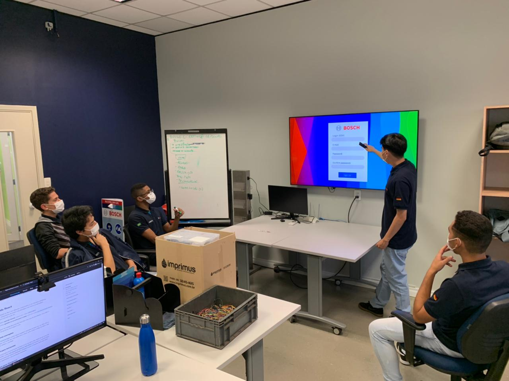

##
 #### Daily Recap: 
- Definition of the division of project responsibilities
- Low-fidelity wireframe
- Choice of group name and mascot
- Data structure prototype
- Definition of first inputs

## Round 2
#### Performed activities:
1. Miura developed the first api that was implemented in the project, used FastAPI for the realization.
2. Abe Structured frontEnd search pages and started testing API Endpoints with Miura.
3. Montanari, Ícaro and Dante started creating the high-fidelity wireframe, already thinking about the design and UI/UX.
4. Dante started designing the site's dashboards.
   
#

### Structuring API Endpoints
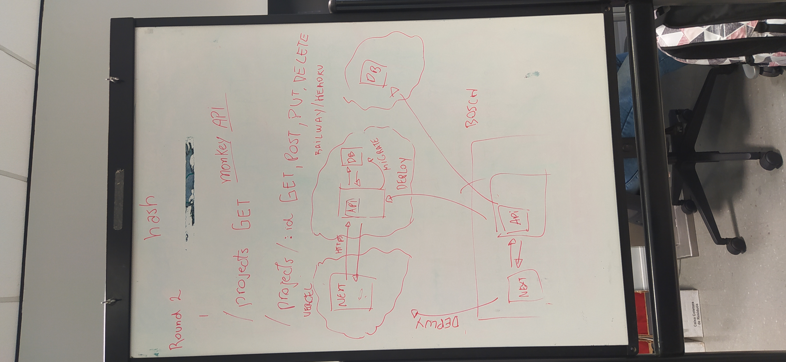

#
### Project preview screen wireframe
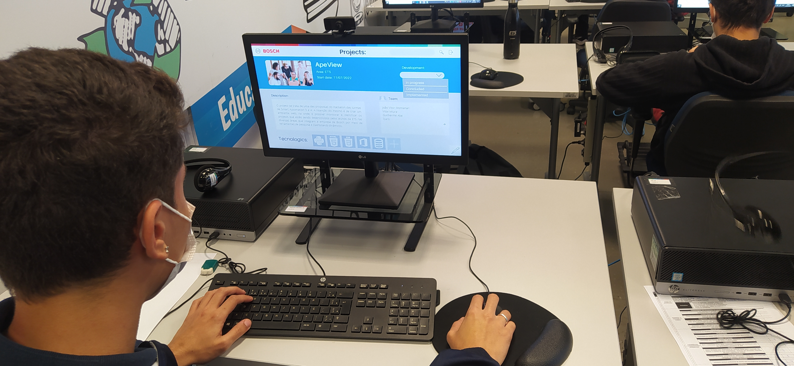
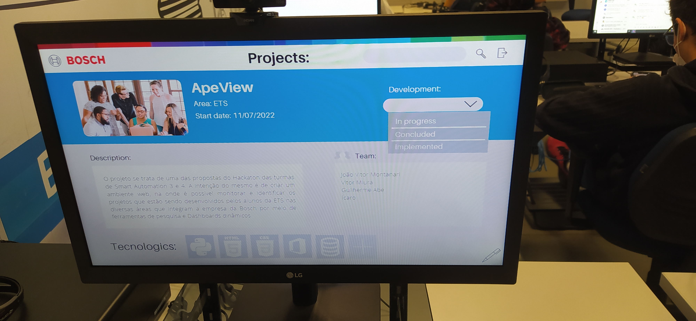

### First frontend interfaces 
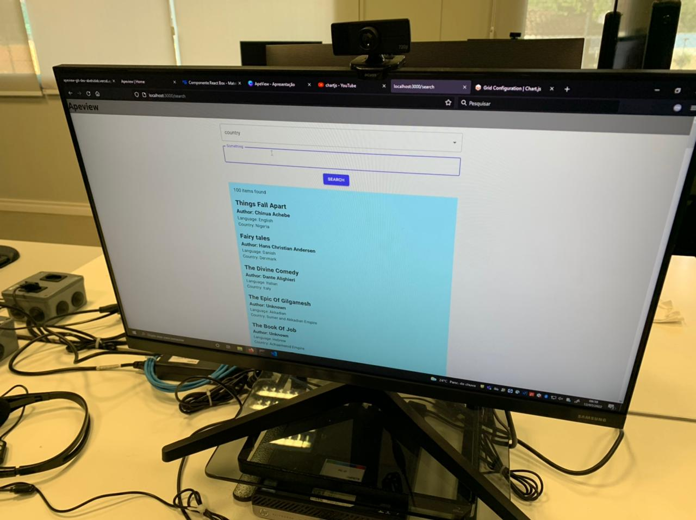
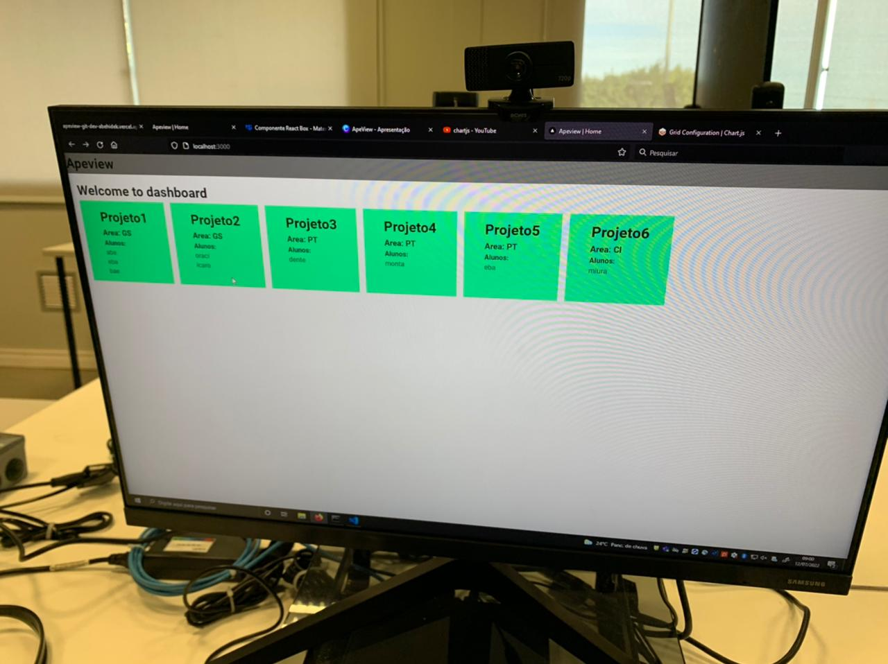

### API development and structuring 
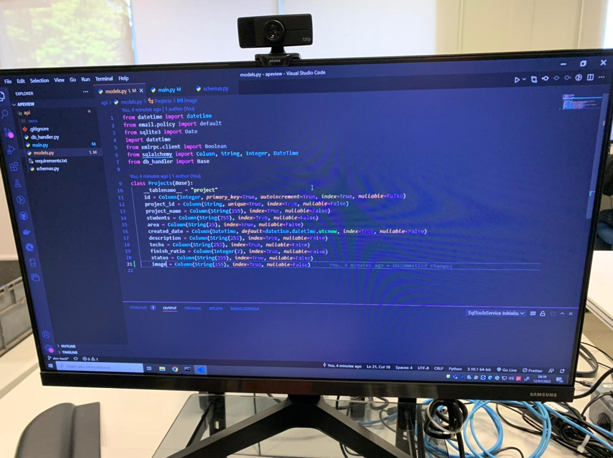
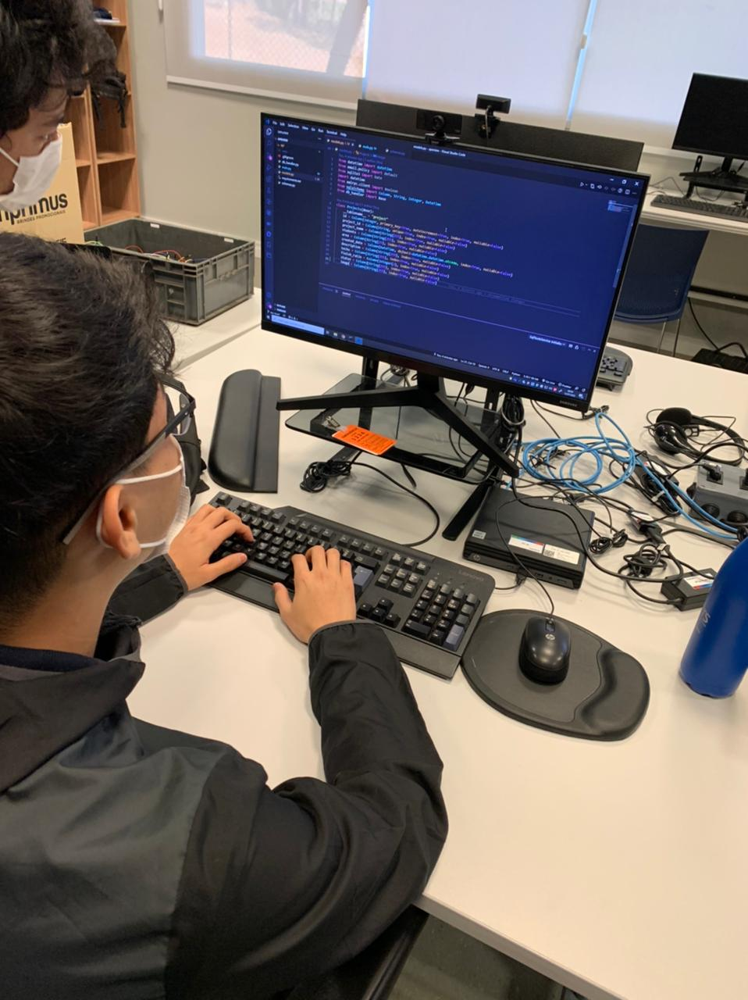

#### Daily Recap:
- Deploy of the first backend APIs and development testing
- Creating the high-fidelity wireframe of the application
- Feedback on progress already made in the project
- Frontend improvements

## Round 3
#### Performed activities:
1. Ícaro started the development of the login and signUp screens.
2. Montanari began creating the **About Us** screen.
3. Miura tested API Endpoints.
4. The group decided to focus more on the front end and styling, leaving dashboards for another round.

#

### Development of Login and About Us screens
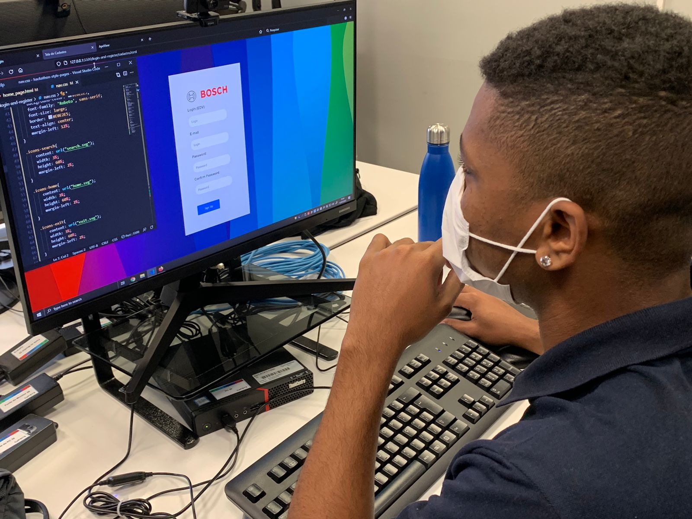
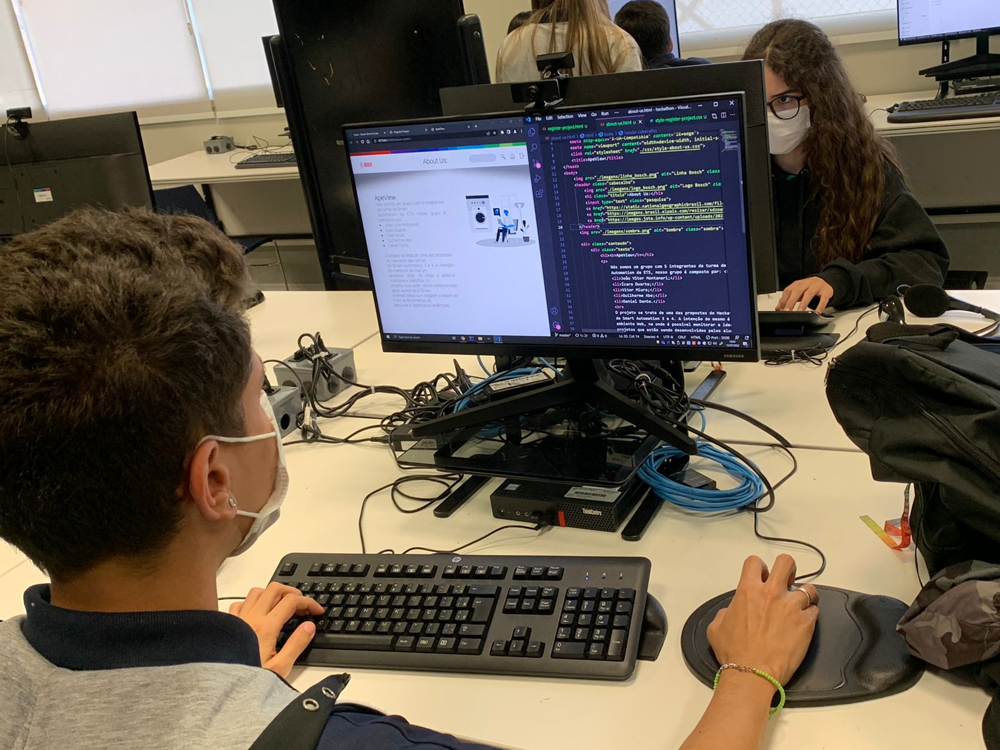

#
###  API unit tests
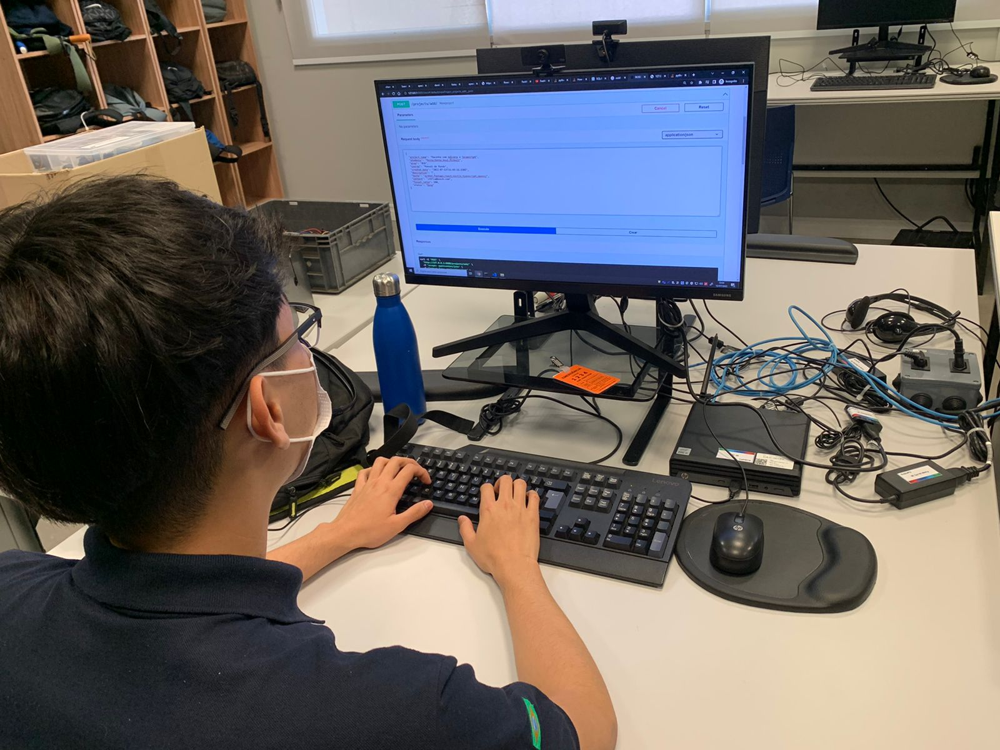

###  Work progressing well, everyone excited! 
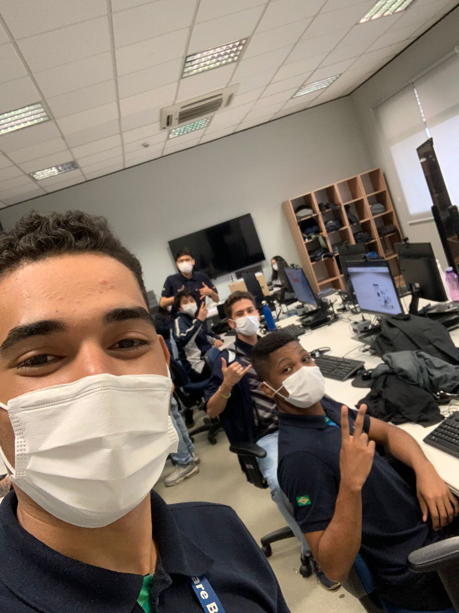

#### Daily Recap:
- Review of previous progress
- Sequence of frontend development
- Improve the API as needed
- Database changes
- Completion of static application screens
- Reprioritization

## Round 4

### Performed activities:
1.The group focused on some styling details and didn't change much.
2. Miura and Abe spent all day solving problems of creating projects and sending data to the Dashboard.

###  First site tests using dashboards
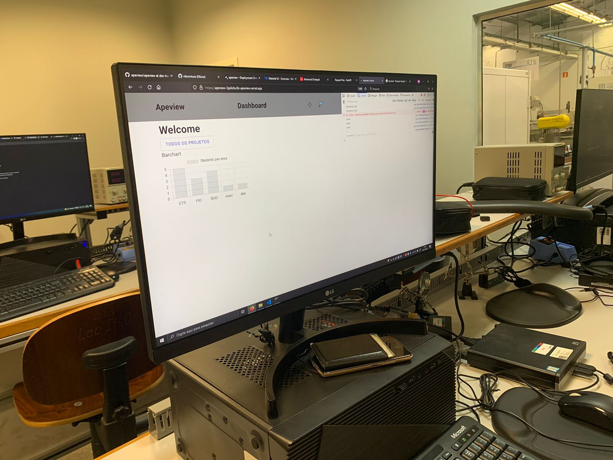
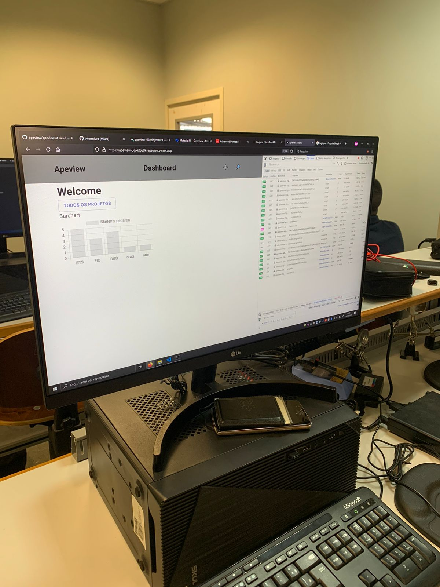

## Round 5

#### Performed activities: 
- Abe and Miura focused on troubleshooting issues and bugs when exporting photos.
- Montanari started the creation of the project presentation video on PowToon.
- Definition of priorities for project completion (Presentation, branding and documentation)
###   Troubleshooting communication with the API
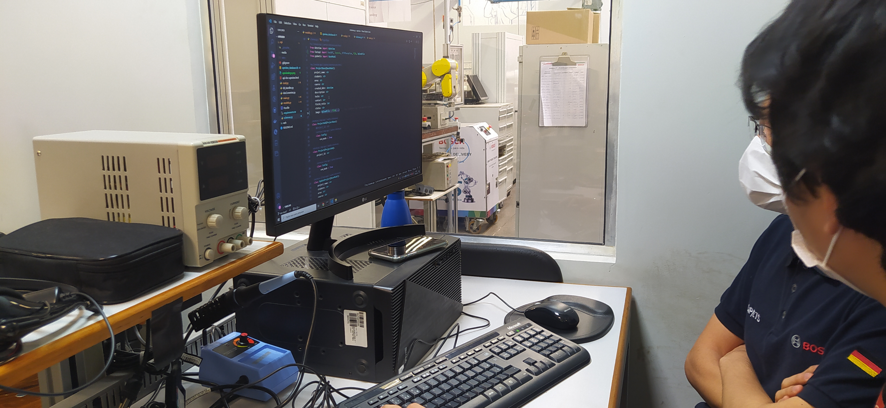

###   Presentation video creation
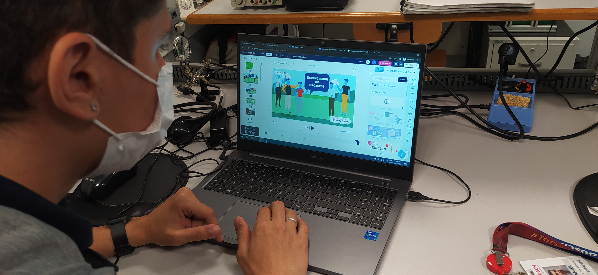

 #

##### **Division of responsibilities**

- Nathã and Giovanna (Marketing, Dashbord graphics in PowerBI, Documentation translation);
- Montanari (POWTOON, React (about us), tidy up presentation);
- Ícaro (React (login, sign up));
- Miura (API endpoint edit image, add real examples in database);
- Dante (Presentation, PowerBI Dashboard and Documentation);
- Abe (Dashboard, styling, and edit image);

# 

## Presentation topics

Total: 15 minutes
| Tópico                    | Tempo | Descrição                                                               |
| ------------------------- | ----- | ----------------------------------------------------------------------- |
| Proposal                  | 1 min | What is the problem to be solved?                                    |
| Introduction to the Application  | 2 min | How our application solves the presented problem                       |
| Methods and tools  | 4 min | Methods and tools used(React, nextJs,etc)                    |
| Impact                   | 2 min | How does the app help and facilitate the work of apprentices and managers? |
| Demonstration              | 5 min | how the app works
