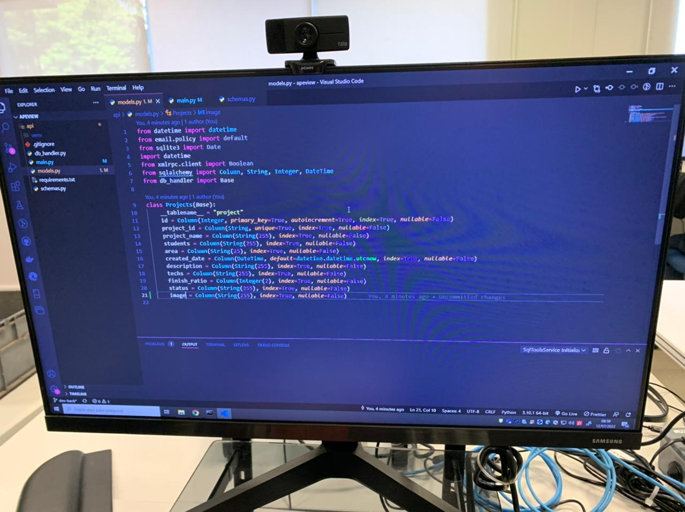

# Documentação APEview

## Divisão e responsáveis
- Daniel Dante - Controle de dados e supervisão do projeto
- Giovana Freitas - Tradução das documentações e Dashboards
- Guilherme Abe - Funcionalidade do frontend e arquiteto
- Ícaro Duarte - Estilização do Frontend
- Nathã Wolff - Idealização das Dashboards e Apresentação
- João Montanari - estilização frontend e Ui/Ux
- Vitor Miura - Backend e DevOps

## Diário de bordo
Para melhor organização e registro de todas as atividades realizadas durante a etapa de desenvolvimento, dividimos o projeto em **Rounds**, em que cada round representa um dia de desenvolvimento, as reuniões e as implementações feitas.

## Round 1 

#### Reunião para a definição de escopo em grupo. 

Essa reunião foi feita para o grupo definir os primeiros passos que vão ser dados com o projeto. Nela foi determinada as tecnologias que seriam utilizadas para o desenvolvimento do mesmo. Definindo o escopo. 

Atividades realizadas:
1. Demos inicio a primeira fase do projeto:   
Idealizar a interface do projeto, o funcionamento e escolher as ferramentas e metodologias que serão utilizadas.
2. Montanari, Ícaro e Dante começaram a desenvolver o primeiro wireframe, focando na utilização do padrão Bosch e adotando métricas do Bosch Brand Guide.
3. Miura  começou a pensar na estruturação de dados e nas tecnologias de como uma criar API.
4. Abe deu inicio a primeira interface frontend, utilizando ReactJs.
5. Criação da logo e mascote do  grupo.
 ###

#

### Definição dos inputs

#
### Definindo o conceito visual das telas

##

 #### Resumo do dia: 
- Definição da divisão de responsabilidades do projeto
- Divisão das tarefas entre os integrantes; 
- Wireframe de baixa fidelidade; 
- Escolha do nome e mascote do grupo; 
- Protótipo da estrutura de dados; 
- Definição dos primeiros inputs;	 

## Round 2

#### Atividades realizadas:
1. Miura desenvolveu a primeira api que foi implementada no projeto, utilizou FastAPI para a realização.
2. Estruturou as paginas de procura do frontEnd e começou a testar os Endpoints da API em conjunto com  Miura.
3. Montanari, Ícaro e Dante começaram a criação do wireframe de alta fidelidade, ja pensando no design e no UI/UX.
4. Dante começou a idealizar as dashboards do site.

#

### Estruturação Endpoints da API 

#
#

### Wireframe tela de visualização do projeto  

### Primeiras interfaces Frontend   

### Desenvolvimento  e estruturação da API   

#### Resumo do dia:
- Deploy das primeiras APIs  do backend, e teste de desenvolvimento
- Criação  do wireframe de  alta fidelidade da aplicação
- Feedback dos avanços já feitos no projeto
- Melhorias no frontend

## Round 3
#### Atividades realizadas:
1. Ícaro deu inicio ao desenvolvimento das telas de login e signUp.
2. Montanari começou a criação da tela **About Us**. 
3. Miura testa Endpoints da API.
4. Grupo decidiu focar mais no front end e na estilização, deixando dashboards para outro round.

#

### Desenvolvimento telas de Login e About Us  

#
### Testes unitários da API  

### Trabalho progredindo bem, todos animados !  

#### Resumo do dia:
- Review dos avanços anteriores
- Sequência no desenvolvimento do frontend
- Aperfeiçoamento da API conforme as necessidades
- Mudança na base de dados
- Finalização das telas estáticas do aplicativo
- Redefinição de prioridades

## Round 4

### Atividades realizadas:
1. O grupo em geral focou em alguns detalhes da estilização e não modificou muita coisa.
2. Miura e Abe ficaram o dia todo resolvendo problema de criação de projetos e envio de dados para Dashboard.

### Primeiros testes no site usando dashboards  

## Round 5

#### Atividades realizadas 
- Abe e Miura focaram na solução de problemas e bugs na hora de exportar fotos.
- Montanari iniciou a Criação do video de apresentação do projeto no PowToon.
- Definição das prioridades para finalização do projeto (Apresentação, marca e documentação)
### Solução de problemas de comunicação com a API  

### Criação do vídeo de apresentação  

 #

##### **Divisão das responsabilidades**

- Natha e Giovana (Marketing, gráficos do Dashbord em powerBI, transcrição da Documentação)
- Montanari (POWTOON, React (about us), arrumar apresentação)
- Ícaro (React (login, sign up))
- Miura (API endpoint edit image, adicionar exemplos reais no banco de dados)
- Dante (Apresentação, Dashboard em powerBI e Documentação)
- Abe (Dashboard, estilização, e edit Imagem)

# 

## Tópicos de apresentação

Total: 15 minutos

| Tópico                    | Tempo | Descrição                                                               |
| ------------------------- | ----- | ----------------------------------------------------------------------- |
| Proposta                  | 1 min | Qual a problematica a ser resolvida?                                    |
| Introdução ao Aplicativo  | 2 min | Como nosso app resolve a problematica apresentada                       |
| Metodologia e Ferramentas | 4 min | Metodogias e ferramentas utilizadas                     |
| Impacto                   | 2 min | Como o app auxilia e facilita o trabalho dos aprendizes e dos gestores? |
| Demonstração              | 5 min | Funcionamento do app                                                    |
